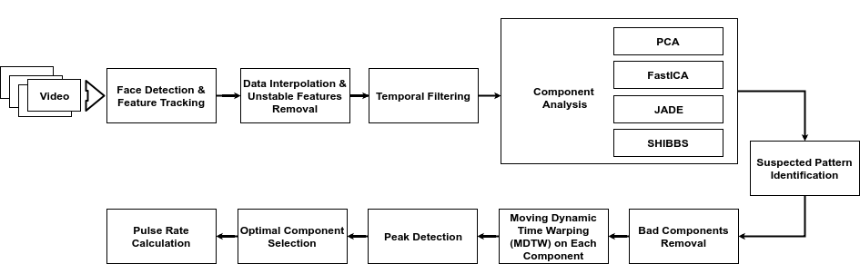
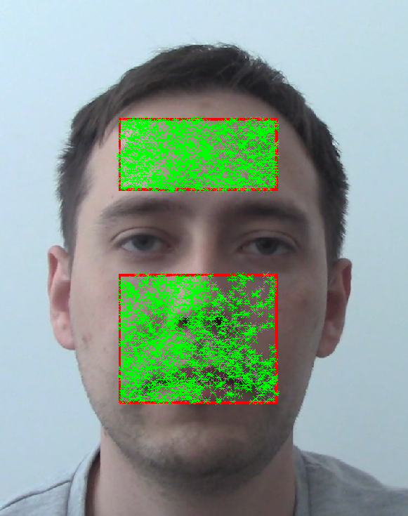
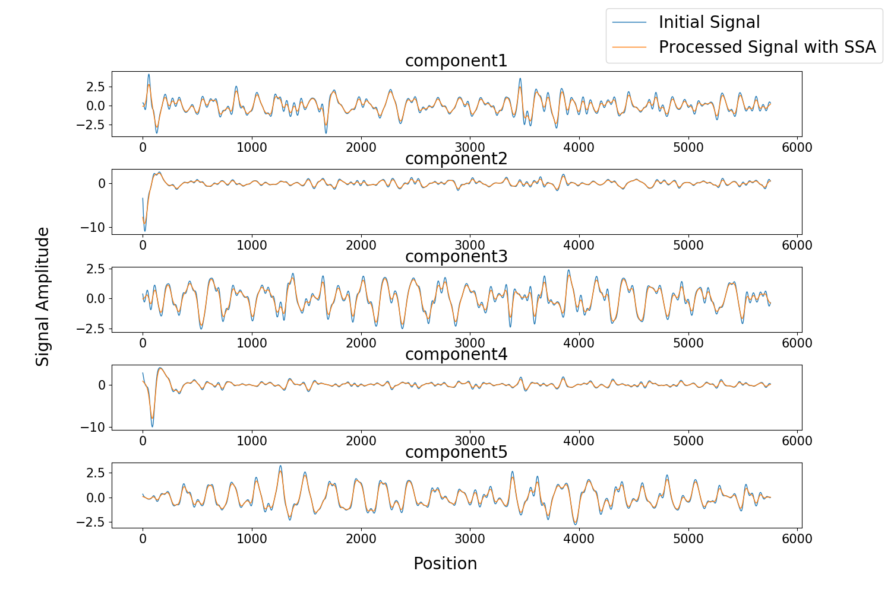
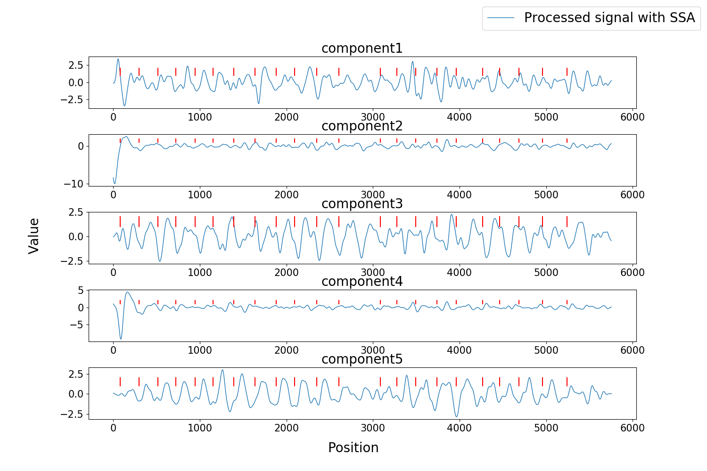
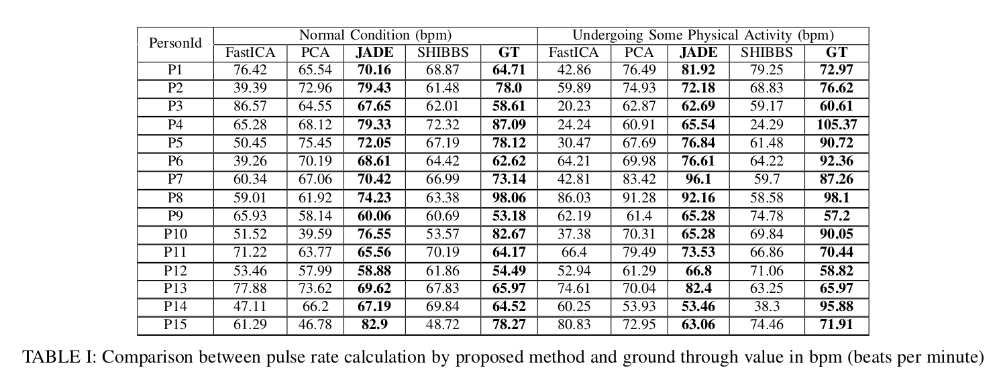
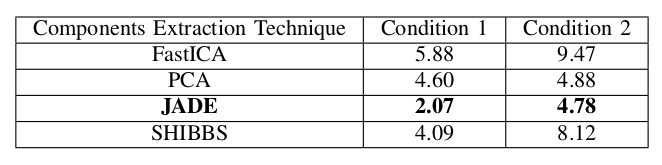

## Towards an algorithm for automatic vision-based pulse detection
> ###### Table of Contents
>
>  * [Abstract](#Abstract)
>  * [Overview](#Overview)
>  * [Dataset](#Dataset)
>  * [Result](#Result)
>  * [Running](#Running)
>  * [Citing](#citing)

### Abstract
Human heartbeat can be measured using several
different ways appropriately based on the patient condition which
includes contact base such as measured by using instruments and
non-contact base such as computer vision assisted techniques.
Non-contact based approached are getting popular due to those
techniques are capable of mitigating some of the limitations of
contact-based techniques especially in clinical section. However,
existing vision guided approaches are not able to prove high
accurate result due to various reason such as the property of
camera, illumination changes, skin tones in face image, etc. We
propose a technique that uses video as an input and returns pulse
rate in output. Initially, key point detection is carried out on
two facial subregions: forehead and nose-mouth. After removing
unstable features, the temporal filtering is applied to isolate
frequencies of interest. Then four component analysis methods
are employed in order to distinguish the cardiovascular pulse
signal from extraneous noise caused by respiration, vestibular
activity and other changes in facial expression. Afterwards,
proposed peak detection technique is applied for each component
which extracted from one of the four different component
selection algorithms. This will enable to locate the positions
of peaks in each component. Proposed automatic components
selection technique is employed in order to select an optimal
component which will be used to calculate the heartbeat.

### Overview
Sequence of steps of proposed methodology how pulse rate is calculated from a facial video

### Steps
1. Face Detection & Feature Tracking

2. Normalized extracted components from JADE algorithm and the result of applying the SSA on each component

3. Motions of interest corresponding to each component

4. This figure shows the peak detection of the result of the MDTW. The horizontal axis represents Pos_v and the
vertical axis represents values of Dis_v . A predefined threshold value is used to control the number of detection points.

5. The figure shows that locations of peak points which correspond to the component that is chosen form ACS. In
this case, the 5th component was selected and then it is used to locate the peak points of original components which were
extracted from the JADE algorithm

### Dataset
Initial data matrix y (size NxM), where: N = number of feature points, M = number of frames (time in seconds * fps)

Interpolated data matrix y_filtered (N*cM): Applied cubic spline interpolation from 'fps' Hz to samplingRate Hz, c = samplingRate/fps

Stable data matrix y_stable (aN*cM): Some unstable feature points are removed, 0 < a < 1

Filtered data matrix y_filtered (aN*cM): Butterworth 5th filter applied

Component Analysis matrix y_xxx (b*cM): b = number of desired extracted components (default = 5)

### Results

### Running

processData.m can be used to extract independent components for a given video
Configurations needs to be changed appropriately in ACS.py and before running the ACS.py. 

### Citing

If you find this paper useful in some way, you can cite it with the following BibTeX entry:
##todo